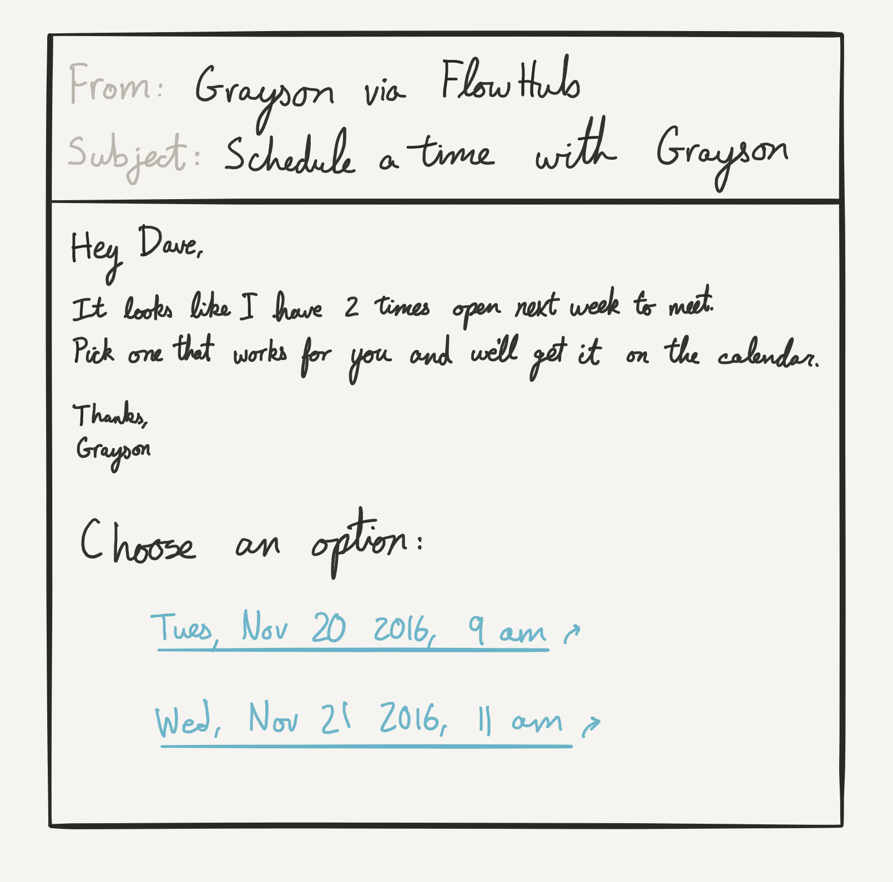

# Book time on your calendar

Booking time with people can be a tedious task,
which makes it a perfect candidate for automation.
Let's look at how to combine emails with several Google Calendar flows
to create a more streamlined process for setting up meetings.


Most requests to set up meetings come in through our email inbox,
so let's use the `email` trigger.
When someone sends us an email asking to book a time,
we can forward it to a FlowHub trigger to start our flow.

Create a new flow and select the "Email" trigger.
The schema will automatically show you
the values that will be passed as input to your flow.

The first thing that our flow should do
is figure out who is requesting time on our calendar.
We've just forwarded an email,
so we can find the requester's information
by looking through the email conversation.

The flow `email_lib/parse_email_conversation` takes an email body as input
and returns a list of the messages in that conversation,
including information about who sent the message.
We can use this to parse out data from our emails.

```ruby
require './flow'

# Parse the email into a list of messages
conversation = Flow.fetch(
  "email_lib/parse_email_conversation",
  body: Flow.input.body,
)

# Pull out everyone's information from the email conversation
my_address = conversation[-1]["from_address"]
my_name = conversation[-1]["from_name"]
their_address = conversation[-2]["from_address"]
their_name = conversation[-2]["from_name"]
```

Now that we have the necessary information about the people involved,
we need to check our calendar to find available times to meet.
Let's use the `google_calendar/available_times` flow to do the hard work for us.

```ruby
# Find available times on your calendar in the next week
available_times = Flow.fetch(
  "google_calendar/available_times",
  start: Time.now,
  end: 1.week.from_now,
  dayStart: "900",
  dayEnd: "1700",
  duration: 60,
)
```

We passed in details like what time our day starts and ends,
and how long we want the meeting to last.
We'll use those later when we send the person a list of available times.

The next step is where the magic happens.
The `flowhub/send_email_with_actions` flow
takes a list of Flow actions
and sends an email that lists out each of those actions as links.
The receiver can click on any link
to trigger the corresponding Flow action.

Let's do a little bit of data processing to get the data in the right format.

```ruby
# Create a list of available times,
# with links to schedule those times in Google Calendar.
# The resulting data structure looks like:
# {
#   "Tuesday, November 20 2016, 9am" => Flow.action(
#     "google_calendar/create_event",
#     ...data...
#   ),
#   "Wednesday, November 21 2016, 11am" => Flow.action(
#     "google_calendar/create_event",
#     ...data...
#   ),
# }
email_actions = available_times.map do |time|
  [
    time.to_s,
    Flow.action(
      "google_calendar/create_event",
      attendees: [my_address, their_address],
      title: "#{their_name} & #{my_name}, 1:1",
      send_invite: true,
    )
  ]
end.to_h
```

Finally, we pass the data structure we just created
into the `flowhub/send_email_with_actions` Flow.
This flow will send an email to the person who requested a meeting.

```ruby
# Add a personalized message to the email
message = "Hey #{their_name},

It looks like I have #{available_times.count} times open next week to meet.
Pick one that works for you and we'll get it on the calendar.

Thanks,
#{my_name}"

# Construct an email message full of links to trigger other flows
Flow.action(
  "flowhub/send_email_with_actions",
  actions: email_actions,
  message: message,
  subject: "Schedule a time with #{my_name}",
  to: time_requester_address,
).trigger
```

They can click a link in the email they receive
to run one of the `google_calendar/create_event` flows that we prepared above.


