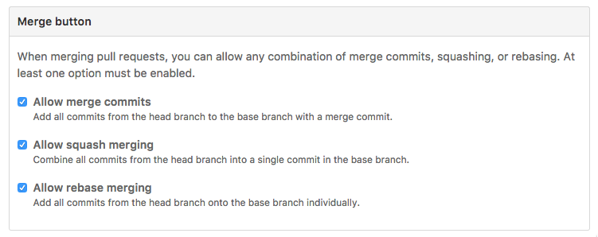
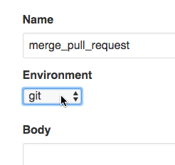
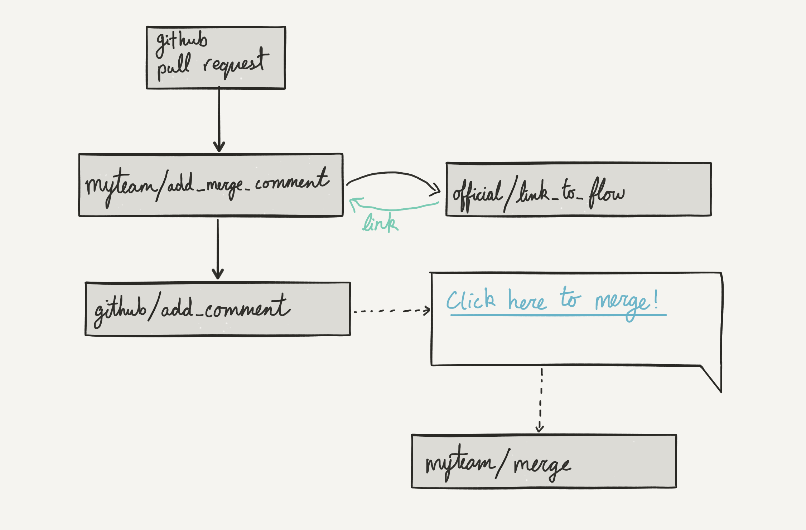
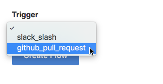

# Custom GitHub merge strategy

There are many ways to merge commits from a GitHub pull request
into the master branch.
Some teams prefer to merge their code changes directly,
to keep the entire commit history intact.
Other teams prefer to rebase their changes into a cleaner format,
for easier scanning after the fact.
At the moment, GitHub supports a few built-in strategies,
but sometimes these aren't flexible enough to match your team's workflow.



By chaining together a few flows,
we can define powerful merge strategies
that are flexible enough to account for different situations.

In this example,
we will create flows to add a custom "Merge" button to our GitHub pull requests.
When a project administrator clicks on "Merge",
a flow will check that the pull request has completed successfully,
pull the code changes onto a virtual machine,
and rebase the code changes on master.
It will confirm that there are no conflicts,
and then push the new commit onto the master branch.

If everything completes successfully,
it can trigger off another flow
to push the code changes to a production server.

## Merge a pull request

Let's start by creating a new flow to run the merge itself.
Later on, we'll hook it up to run when someone clicks a button.

Our flow will mostly be working with git,
so let's select a base image that has git installed.



We'll start by cloning the git repo onto our computer.
The URL and branch name for this repo will need to be passed into our script,
so we should define them in the input schema.

```json
{
  "type": "object",
  "properties": {
    "git_url": { "type": "string" },
    "branch_name": { "type": "string" }
  },
  "required": ["git_url", "branch_name"]
}
```

We can use URL and branch name in our flow
by accessing them with the `flow input` command.

```bash
git clone $(flow input git_url)
git checkout $(flow input branch_name)
```

After that, it's up to you to define your custom merging strategy.
Here's what we use ourselves at Flows.

```bash
# exit immediately if any command fails
set -e

# rebase our branch on master, squashing any `fixup!` commits
git rebase --autosquash origin/master
# push to GitHub ONLY if there were no changes in the meantime
git push --force-with-lease

# Run the tests once more
# to be sure nothing broke during the rebase
bundle install
bundle exec rake

# Switch to master and make sure it's up to date
git checkout master
git pull

# Merge ONLY if there were no changes to master in the meantime
git merge --ff-only $(flow input branch_name)
git push

# delete the local and remote branches
git branch -d $(flow input branch_name)
git push --force-with-lease origin :$(flow input branch_name)
```

If you have a Flow that pushes code to staging or production environments,
now might be a good time to kick that off with the `flow trigger` command.

```bash
# Your deployment flow might take different arguments
flow trigger myteam/deploy environment=staging branch=master
```

And that's it! Whenever this flow is triggered with a Git URL and a branch name,
it will merge that branch into the repository with your custom merge strategy.

## Hook it up to a button

Now that we have a flow for merging our GitHub pull requests,
we need to hook up an easy way for people to trigger the flow.

We want users to be able to click a button in the pull request comment thread
to start the merge process.
To do that, we'll watch for new pull requests
and comment on each of them with a link to trigger the merge flow.



Here's what that looks like.

Create a new flow that subscribes to the `GitHub Pull Request` event.



When a new pull request is created and our flow is kicked off,
we'll use the `github/add_comment` flow
to add a link to the github conversation.

```ruby
# Ruby
require "./flow"

comment_text = Flow.fetch(
  "official/link_to_flow",
  flow: "myteam/merge",
  text: "Click here to merge!",
  data: {
    url: Flow.input.repository_url,
    branch_name: Flow.input.branch_name,
  },
)

Flow.trigger("github/add_comment", text: comment_text)
```

```javascript
// Javascript
Flow = require("./flow.js")

comment_text = Flow.fetch("official/link_to_flow", {
  flow: "myteam/merge",
  text: "Click here to merge!",
  data: {
    url: Flow.input.repository_url,
    branch_name: Flow.input.branch_name,
  },
})

Flow.trigger("github/add_comment", { text: comment_text })
```

Now, any pull request you open will have a handy link added to it
that will kick off your custom merge flow.

- - - - -

Feedback form:

* Was this information helpful? (Y/N)
* How likely are you to build a flow like this? (1-5)
* How can we change this to make it more helpful? (free-form)
